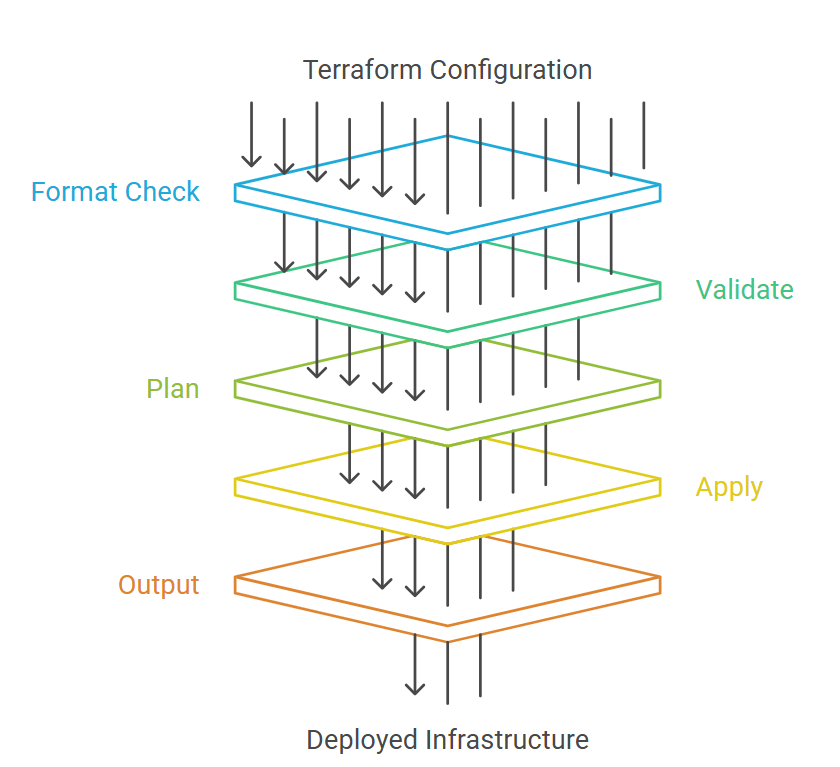

# Infrastructure as Code (IaC) – Terraform Practical Guide

> A DevOps & Cloud Architect’s guide to **Infrastructure as Code**, explaining *why it exists*, *who needs it*, *how it differs from tools like Ansible and Jenkins*, and *how to use Terraform locally and in teams.*

---





##  What is Infrastructure as Code (IaC)?

**Infrastructure as Code (IaC)** is the practice of **defining, provisioning, and managing infrastructure using declarative code** instead of manual processes or scripts.

With IaC:
- Infrastructure becomes **version-controlled**
- Environments are **repeatable and predictable**
- Changes are **auditable and reviewable**
- Drift between desired and actual state is **detectable**

Terraform is one of the most widely adopted IaC tools because it supports **multi-cloud, hybrid, and on-prem** environments with a consistent workflow.

---

## 👥 Who Is IaC Required For?

IaC is essential for:

- DevOps & Platform Engineering teams  
- Cloud & Solution Architects  
- SRE teams managing availability and scale  
- Enterprises with compliance & audit requirements  
- Startups scaling across regions and environments  

If your infrastructure must be:
- recreated quickly
- scaled safely
- governed centrally
- audited reliably  


---

## ⚖️ How IaC Differs from Ansible & Jenkins

### Terraform vs Ansible vs Jenkins

| Aspect | Terraform (IaC) | Ansible | Jenkins |
|-----|-----|-----|-----|
| Primary purpose | Infrastructure lifecycle | Configuration management | CI/CD orchestration |
| Model | Declarative | Imperative | Imperative |
| Infrastructure state | ✅ Managed | ❌ Not tracked | ❌ Not applicable |
| Drift detection | ✅ Native | ❌ None | ❌ None |
| Infra creation | ✅ Yes | ⚠️ Limited | ❌ No |
| App deployment | ❌ No | ✅ Yes | ✅ Yes |
| Best role | Infra provisioning | OS/App config | Pipeline automation |

### Rule of Thumb
- **Terraform** → *What infrastructure should exist*
- **Ansible** → *What should run on that infrastructure*
- **Jenkins** → *When and how automation is triggered*

These tools **complement**, not replace, each other.

---

## Terraform Local Deployment (Developer Workflow)

### Install Terraform
https://developer.hashicorp.com/terraform/install

### Terraform Building Blocks
- Terraform configuration files (written in HCL)
- Terraform modules (collections of configs)
- Terraform plans/state (artifacts generated during execution)

### Terraform Folder structure 
Use this as a recommended developer layout — keep modules and environment overlays separated for clarity:

```text
terraform/
├── main.tf              # Core infrastructure resources
├── variables.tf         # Input variables
├── outputs.tf           # Exported values
├── providers.tf         # Cloud providers & versions
├── backend.tf           # Remote state configuration
├── terraform.tfvars     # Environment-specific values (do NOT commit secrets)
├── modules/             # Reusable modules
│   ├── network/
│   ├── compute/
│   └── security/
└── envs/                # Environment overlays (workspaces or separate state backends)
    ├── dev/
    │   ├── terraform.tfvars
    │   └── override.tf
    ├── uat/
    └── prod/
```

(Keep secrets out of repo; use a secrets manager or encrypted variable storage for sensitive values.)


### Basic Terraform workflow (how to execute)
A concise per-developer checklist for local runs and CI jobs. Always run format and validation before planning, then create a plan and apply the reviewed plan.

1. Format & lint
2. Validate configuration
3. Init (and configure backend)
4. Plan (output to file)
5. Review plan
6. Apply the plan (or use CI/Terraform Cloud for remote apply)
7. Inspect outputs

Example command sequence (local developer):

```bash
terraform version
terraform login                    # for Terraform Cloud (optional, when you are using enterprise account only this is required)
terraform fmt -check               # code formatting
terraform validate                 # syntax & basic checks
terraform init -backend-config=... # or terraform init -reconfigure
terraform workspace select <env>   # or terraform workspace new <env>
terraform plan -var-file=<env>.tfvars -out=tfplan
# review tfplan (terraform show -json tfplan) and approvals
terraform apply tfplan
terraform output -json
```


## What Enterprise Terraform brings in 

Terraform Cloud adds governance and collaboration on top of open-source Terraform.

- Remote state with locking
- Role-based access control (RBAC)
- Policy-as-Code (Sentinel)
- Secure variable management
- Audit logs for compliance
- Team-based workflows
- Enterprise-grade scalability

## Standard Devops Terraform Workflows

Below are common scenarios and the corresponding example command sequences. Use these as recipes and adapt them to your CI/CD and governance model.

| Scenario | Example | Command sequence |
|---|---|---|
| Provisioning new infrastructure | Create a new VPC/VNet, subnets, security rules, compute, and load balancer for a new app environment. | `terraform version -> terraform login -> terraform fmt -check -> terraform validate -> terraform init -backend-config=... (or -reconfigure) -> terraform workspace select <env> (or new) -> terraform plan -var-file=<env>.tfvars -out=tfplan -> (review/approve) -> terraform apply tfplan -> terraform output -json` |
| Provisioning a new environment (dev/uat/prod isolation) | Spin up a new UAT environment from the same codebase with isolated state. | `terraform workspace list -> terraform workspace select uat || terraform workspace new uat -> terraform init -reconfigure -> terraform plan -var-file=uat.tfvars -out=tfplan -> terraform apply tfplan -> terraform output -json` |
| Routine change / feature rollout (change management) | Add a subnet, update an autoscaling setting, attach a new IAM policy, or adjust tags. | `terraform fmt -check -> terraform validate -> tflint -> terraform plan -var-file=<env>.tfvars -out=tfplan -> (review/approve + security scans) -> terraform apply tfplan -> terraform output -raw <name>` |
| Scaling due to high load (controlled, repeatable scaling) | Increase node-group size or ASG desired capacity when traffic spikes. | `terraform fmt -check -> terraform validate -> terraform plan -var-file=<env>.tfvars -out=tfplan -> terraform apply tfplan -> terraform output (confirm capacity)` |
| Emergency mitigation during incident (targeted action; normalize after) | Replace a broken resource or quickly add capacity for one component, then return to a clean declared state. | `terraform init -> terraform plan -target=<resource> -out=tfplan (or terraform apply -replace=<resource>) -> (fast approval) -> terraform apply tfplan -> terraform plan -out=tfplan2 -> terraform apply tfplan2` |
| Drift detection | Someone changed security group rules in the cloud console during an outage. | `terraform init -> terraform plan -refresh-only -> (decide revert vs codify) -> terraform plan -out=tfplan -> terraform apply tfplan` |
| Brownfield takeover (import existing cloud resource into IaC) | An S3 bucket or VPC exists already; you want Terraform to manage it going forward. | `terraform init -> terraform import <resource> <remote_id> -> terraform state show <resource> -> update HCL to match reality -> tflint -> terraform plan -out=tfplan -> terraform apply tfplan` |
| State backup / inspection for audit or troubleshooting | Take a snapshot of state and inspect key resources before a risky change window. | `terraform state pull > terraform.tfstate.backup -> terraform state list -> terraform state show <resource> -> terraform show -json` |
| Provider address migration (registry address changes) | Migrate resources in state when provider source address changes due to refactor/registry updates. | `terraform init -> terraform state replace-provider <from> <to> -> terraform init -reconfigure -> terraform plan -out=tfplan -> terraform apply tfplan` |
| Decommission / teardown environment (cost & hygiene) | End-of-life service or temporary test environment cleanup. | `terraform plan -destroy -var-file=<env>.tfvars -out=tfplan -> (review) -> terraform destroy -auto-approve (or apply tfplan) -> terraform output (optional check)` |
| CI/CD pipeline automation | Automate plan/apply with review gates and remote state in Terraform Cloud/Enterprise. | `terraform login -> terraform init -reconfigure -> terraform plan -var-file=<env>.tfvars -out=tfplan -> run tflint/checkov -> (manual or PR approval) -> terraform apply tfplan (or terraform apply -auto-approve in gated runs)` |
| Testing & static analysis | Catch errors before apply using linters and tests. | `terraform fmt -check -> terraform validate -> tflint -> tfsec or checkov -> unit/integration tests (Terratest) -> terraform plan -out=tfplan` |
| Blue/Green or Canary infra changes | Minimize user impact during releases by deploying parallel infra and shifting traffic. | `deploy canary stack (separate workspace or env) -> terraform plan -var-file=canary.tfvars -out=tfplan -> terraform apply tfplan -> shift traffic via LB/route -> monitor -> promote or rollback -> terraform apply to prod stack` |
| Database schema & migration orchestration | Coordinate infra changes with DB schema migrations for SaaS apps. | `terraform apply tfplan (provision infra) -> run DB migration tool (Flyway/liquibase) in pipeline -> smoke tests -> terraform plan -> terraform apply` |
| Secrets lifecycle & rotation | Manage secrets securely and avoid plaintext in state. | `use Vault/Secrets Manager resources (avoid plain vars) -> terraform init -> terraform plan -out=tfplan -> terraform apply tfplan -> rotate secrets via provider or external tool -> ensure state encryption and restricted access` |
| Cost estimation & guardrails | Estimate cost impact before changes and enforce budgets. | `terraform plan -out=tfplan -> terraform show -json tfplan | infracost breakdown (or infracost run) -> review cost delta -> apply with approvals` |
| Backup & restore (state recovery) | Recover from accidental state corruption or resource deletion. | `terraform state pull > backup.tfstate -> terraform state rm <addr> (if needed) -> terraform import or terraform state push (careful) -> terraform plan -out=tfplan -> terraform apply tfplan` |
| Observability & monitoring setup | Provision monitoring, alerts, and dashboards for SaaS app health. | `terraform fmt -check -> terraform validate -> terraform plan -out=tfplan -> terraform apply tfplan -> verify metrics/alerts -> integrate with pager/ops` |
